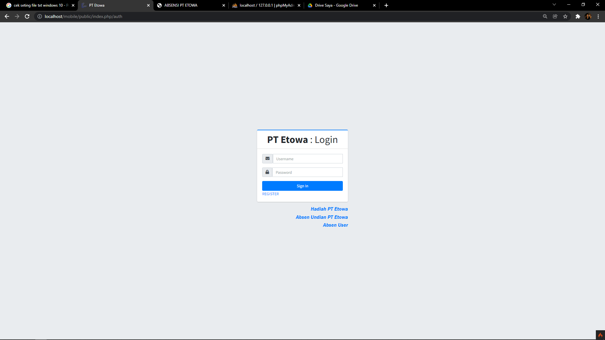

# Android App By ringga septia Pribadi

This is an example Android Application README to show briefly the sections your app README should contain.

```
Projeck bersifat pribadi dan tidak untuk di perjual belikan, 
semua code merupakan pengembangan dari developer sendiri dengan bantuan beberapa perpustakaan yang di gunakan
project di tujukan untuk mempermudah dalam perekapan absen user, dan mempermudah dalam hal evaluasi user
app terdiri dari 2 bentuk entitas yaitu apk dan web
```


## Build variants
Use the Android Studio *Build Variants* button to choose between **production** and **staging** flavors combined with debug and release build types


## Generating signed APK
From Android Studio:
1. ***Build*** menu
2. ***Generate Signed APK...***
3. Fill in the keystore information *(you only need to do this once manually and then let Android Studio remember it)*


## Contributing

1. Ringga septia pribadi
2. Create your feature branch (git checkout -b my-new-feature)
3. Commit your changes (git commit -m 'Add some feature')
4. Run the linter (ruby lint.rb').
5. Push your branch (git push origin my-new-feature)
6. Create a new Pull Request

  
  
  
  
  
  

